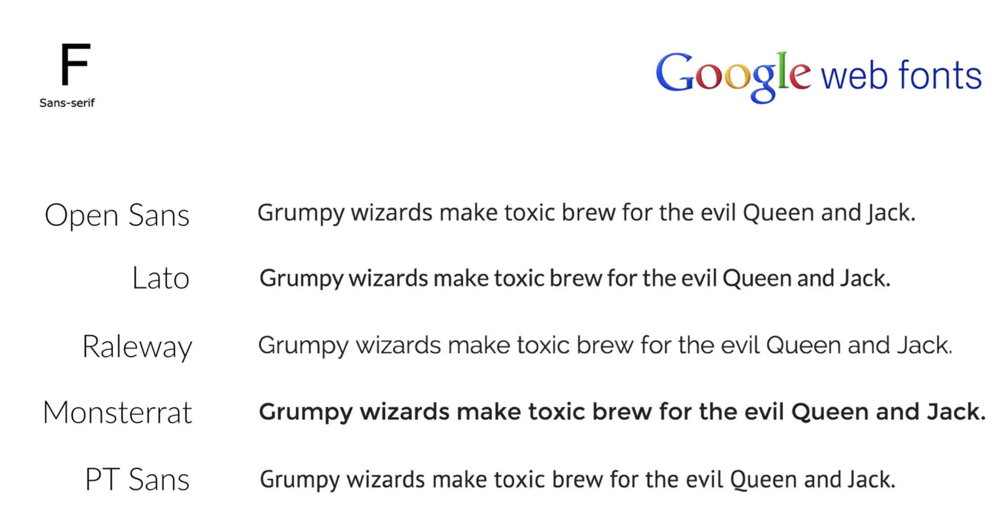
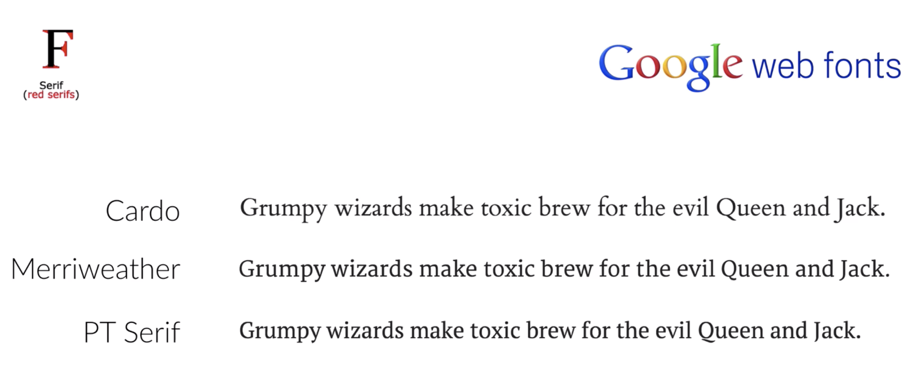

# HTML/CSS/Web Design Typography Practice Notes
Hi there! This is just a simple note of learning html and css!

## HTML Section
 - `<!-- This is a comment section-->`
 - A html file's basic structure:
```html
<!DOCTYPE HTML>
<html>
<head>
<!--head part is used for title, link, etc.-->
</head>
<body>
<!--body part is used for cotent. -->
</body>
</html>
```
### Head Part
- `<title>some title</title>` is used for the title of the whole webpage.
- `<link rel="stylesheet" type="text/css" href="style.css" />` using link tag to link the style.css file to our index.html file. So that we can use a external css file to style up our html file.

### Body part
- There are 6 levels of headings: `<h1>` to `<h6>`.
- We use divisions to create blocks in our page, the class is used for styling in our css file.
```html
<div class="author-box">
<h1>This is a heading.</h1>
<p>Some post about html/css.</p>
</div>
```
- Some usefull tags
```html
<p>This is <strong>strong</strong>!</p>
<p>This is <em>em</em>phasize.</p>
<p>This is <u>underlined</u> text.</p>
<p>
this is a break<br>So that this is the second line.
</p>
<a href="https://github.com/YijuanZhi" target="_blank">Link to my github.</a>

```
And the following cotent is the result of the previous code:
<p>This is <strong>strong</strong>!</p>
<p>This is <em>em</em>phasize.</p>
<p>This is <u>underlined</u> text.</p>
<p>
this is a break<br>So that this is the second line.
</p>
<a href="https://github.com/YijuanZhi" target="_blank">Link to my github.</a>


Result section ends here.
(Markdown file in github seems to fail to fetch the image in another folder sometimes.)

## CSS Section
- For elements in html, class can be used for as many times as we want, but id can only be used once in each html document.
- CSS consists of selectors and their declaration blocks. Here are some instances of selectors for *, tag, class and id:
```css
/*
  * is for the whole webpage including everyhing.
*/
*{
  /* top right bottom left*/
  padding: 5px 0px 5px 0px;
}

/*
body is for the whole body part
*/
body {
  /*background-image: url("images/blur-clean.jpg");*/
  color: black;
  font-size: 14px;
  font-family: Arial, Helvetica, sans-serif;
  text-align: center;
}

/*
 for the tags
*/
h3,
p {
  color: darkslateblue;
  font-size: 14px;
  font-family: Helvetica, sans-serif;
  text-align: justify;
}

/*
.main-text is used for a class
#main-text is used for a id(which we usually do not use)
*/
.main-text {
  color: grey;
  text-align: justify;
  text-indent: 40px;
}

#author-text {
  color: mediumseagreen;
  font-size: 10px;
  float: left;
  margin-top: 70px;
}
```
- Here are some very useful properties:
```
/* top right bottom left(same works for margin)*/
padding: 5px 0px 5px 0px;

/*text indent for the first line of text. */
text-indent: 40px;
  
/*
relative makes different element connect to each other in some way, but absolute makes them relative only to the whole border. 
*/
position: relative;
position: absolute;

/*
We use float to make different element can be placed side by side instead of up and down.
*/
float: left;
float: right;

/*
make stuff after this division sepereated visually from this and previous divisions.
*/
.clearfix::after {
  content: "";
  display: table;
  clear: both;
}

/*
overflow:auto; is going to everything presented inside the box instead of coming out of the border.

*/
overflow: auto;

/*
top and right is absolute to the border of the current selector.

*/
.date {
  position: absolute;
  top: 0;
  right: 0;
}
```

## Web Design Typography
- Use a font size of 15px to 25 px(like 22px) for the body text depending on the whole view of the website.
- *BIG* title, depending on what is the main part of the view. 
- Use line spacing between 120% to 150%(like 150%).
- For each text line, 45 to 90 characters is good.
- Good fonts examples:

- Good fonts or a lot of text:

